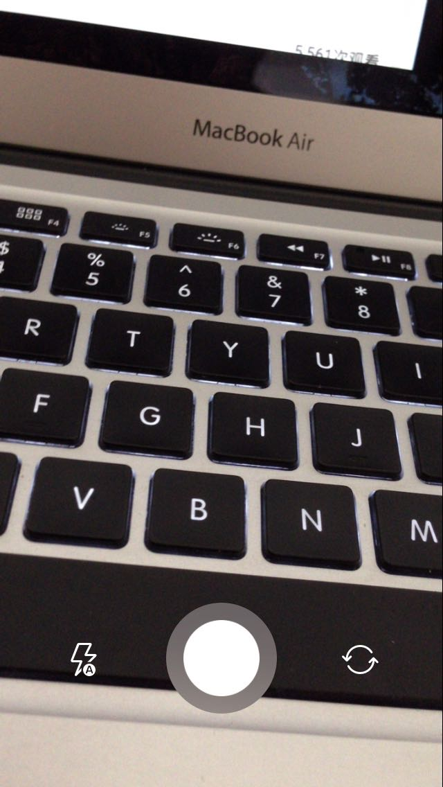
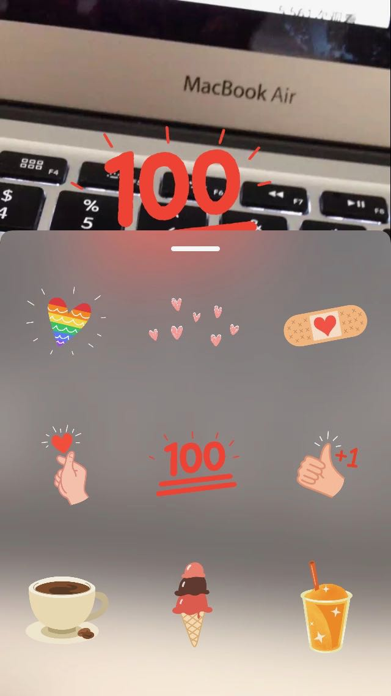
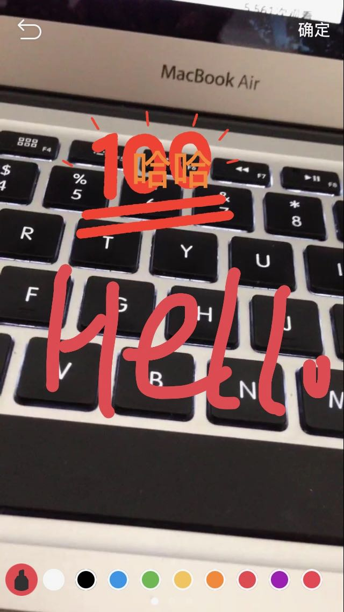

TLStoryCamera
==================

# TODO
* Fix Bugs
* 实现滤镜切换功能

# Introduce
* 仿照instagramStory & WeiBoStory。可以在拍摄视频后贴图，贴字，涂鸦。

# System Requirement
* iOS 8.0 or later
* Xcode 8.0 or later

# 特性
* 基本实现WeiboStory的大部分功能
* 支持码率，美颜开关等多项配置
* 支持长按录像&短按拍照
* 支持相册选择图片&视频
* 使用Swift 3开发

# 依赖框架
* GPUImage
* SVProgressHUD

# Usage
* 克隆项目后，需要使用Cocoapods Install

# Warning！
* 项目部分图片素材来自WeiBo，请替换后使用！
* 目前项目尚处于开发阶段，不建议直接在企业项目中使用。

# Images

