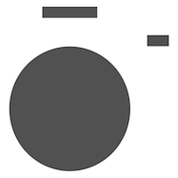

TLStoryCamera
==============
<center></center>

# TODO
* Support CocoaPods
* Fix bugs

# Introduce
* 仿照instagramStory & WeiBoStory。可以在拍摄视频后贴图，贴字，涂鸦。
* You can put up picture, text or doodle after shooting a video. just like the app Instagram and Weibo 's story

# Requirements
* iOS 8.0 or later
* Swift 4.0 or later
* Xcode 8.0 or later

# Character
* 基本实现WeiboStory的大部分功能
* Implement most of the function of Weibo's story
* 支持滑动切换滤镜
* Support slide filter
* 支持码率，美颜开关等多项配置
* Support config kpbs, beautifyFilter
* 支持长按录像&短按拍照
* Support long press to shoot a video or short press to take a photo
* 支持相册选择图片&视频
* Support import video or photo from album
* 支持添加导出视频水印
* Support watermark of output movie

# Depend on framwork
* GPUImage
* MBProgressHUD

# Usage
* 请使用真机运行Demo
* Please use iOS device run this demo

```
let storyVc = TLStoryViewController()
storyVc.view.frame = CGRect.init(x: 0, y: -44, width: screenWidth, height: screenHeight)
storyVc.delegate = self
scrollView.addSubview(storyVc.view)
self.addChildViewController(storyVc)

extension ViewController:TLStoryViewDelegate {
    func storyViewClose() {
    }
    
    func storyViewRecording(running complete: Bool) {
    
    }
     
    //get output video & photo
    func storyViewDidPublish(type: TLStoryType, url: URL?) {
        guard let u = url else {
            return
        }
        print("\(type)-----\(u)")
    }
}
```

# FAQ
* **Recorded movies start with a short duration of black video**
* [GPUImage·issues·#52](https://github.com/BradLarson/GPUImage/issues/52)

* **CVOpenGLESTextureCacheRef leak when I'm using GPUImageMovieWriter**
* [GPUImage·issues·#2500](https://github.com/BradLarson/GPUImage/issues/2500)

* **How to build this project**
* https://timelessg.cn/index.php/archives/3/


# Warning！
* 项目部分图片素材来自WeiBo，请替换后使用！
* Partial resourse come frome Weibo, please use after replacing


# Images


